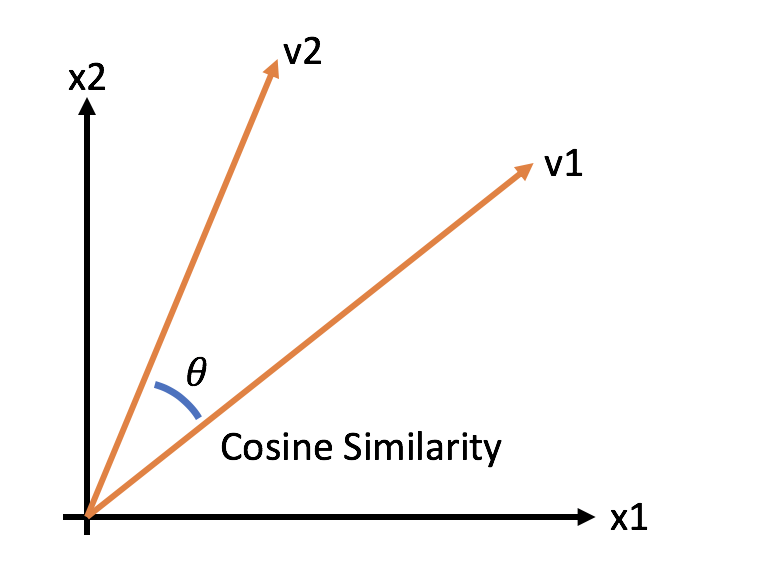

 

# Procesamiento de Lenguaje Natural

Este repositorio contiene los desafíos planteados para la materia de NLP del posgrado de FIUBA - CEIA.

 

## Vectorización de texto y modelo de clasificación Naïve Bayes

En base al dataset 20newsgroups, se creó una matriz documento-término. Esto se logró mediante la aplicación de un vectorizador TfidfVectorizer sobre el conjunto de datos de entrenamiento. Luego, se empleó cosine_similarity para identificar los documentos más similares. Seguidamente, se entrenaron modelos de clasificación Naive Bayes (ComplementNB y MultinomialNB), utilizando el conjunto de datos de entrenamiento. Finalmente, se transpuso la matriz documento-término para obtener una matriz término-documento, lo que permitió examinar la similitud entre palabras.

[Jupyter Notebook link](https://github.com/javierjosev/procesamiento_lenguaje_natural/blob/main/notebooks/Desafio_1.ipynb)

 

## Custom embeddings con Gensim

Para este desafío, se optó por el conjunto de datos de BBC News con el propósito de generar vectores utilizando  Word2Vec de Gensim. Luego, se exploraron términos de interés y se explicaron las similitudes en el espacio de embeddings. Para completar, se crearon gráficos que representan la similitud de las palabras dentro del contexto del conjunto de datos.

[Jupyter Notebook link](https://github.com/javierjosev/procesamiento_lenguaje_natural/blob/main/notebooks/Desafio_2/Desafio_2.ipynb)

 

## Predicción de próxima palabra

El objetivo fue entrenar un modelo de lenguaje basado en RNN utilizando el conjunto de datos de BBC News. Durante este proceso, se exploraron diversas técnicas de generación de secuencias y se evaluó su calidad calculando la perplejidad. Un aspecto clave de este desafío fue organizar y estructurar adecuadamente el conjunto de datos para abordar el problema.

[Jupyter Notebook link](https://github.com/javierjosev/procesamiento_lenguaje_natural/blob/main/notebooks/Desafio_3/Desafio_3.ipynb)

 

## LSTM Bot QA

Se utilizaron los datos disponibles del desafío ConvAI2 (Conversational Intelligence Challenge 2), que consisten en conversaciones en inglés, para desarrollar un BOT. Para ello, se emplearon embeddings de palabras y redes neuronales recurrentes (LSTM) con el fin de responder preguntas del usuario (QA).

[Jupyter Notebook link](https://github.com/javierjosev/procesamiento_lenguaje_natural/blob/main/notebooks/Desafio_4/Desafio_4.ipynb)

 

## BERT Sentiment Analysis

En este desafío, se entrenó un modelo de BERT para realizar análisis de sentimientos sobre un conjunto de datos de críticas de Google Apps.

[Jupyter Notebook link](https://github.com/javierjosev/procesamiento_lenguaje_natural/blob/main/notebooks/Desafio_5/Desafio_5.ipynb)

  
## Contacto
Si estás interesado en mi trabajo, puedes contactarme mediante:

&nbsp; &nbsp; &nbsp;
 &nbsp; &nbsp; &nbsp;

Muchas gracias! :wink: